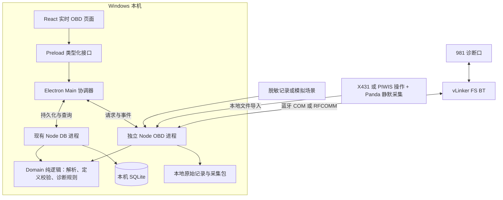
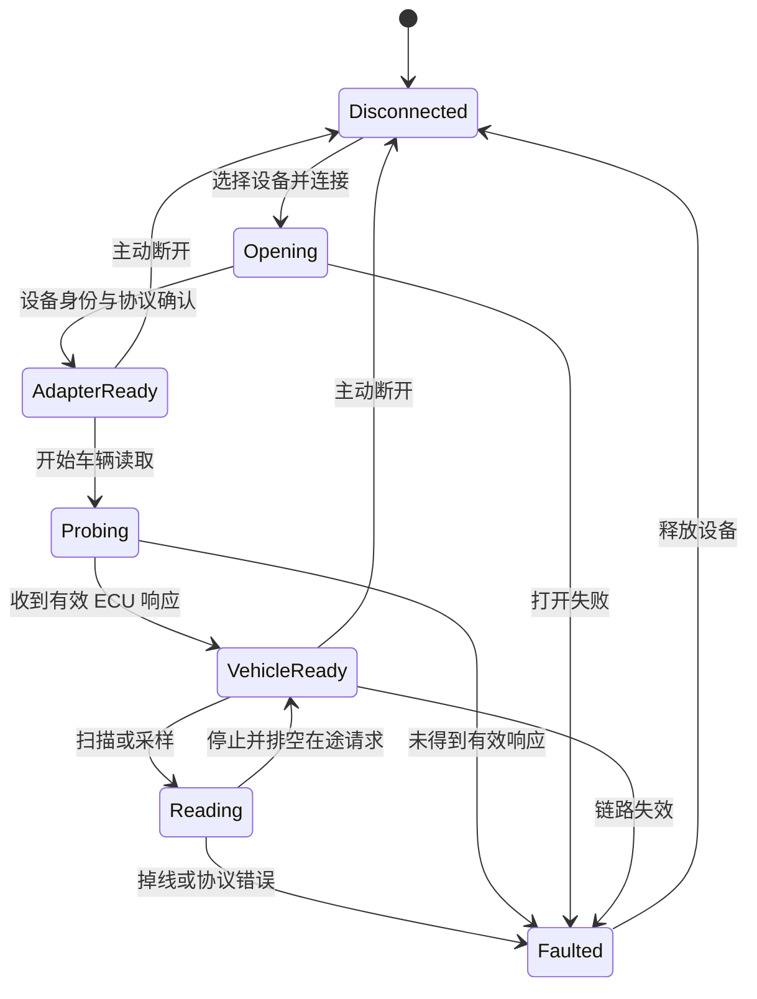
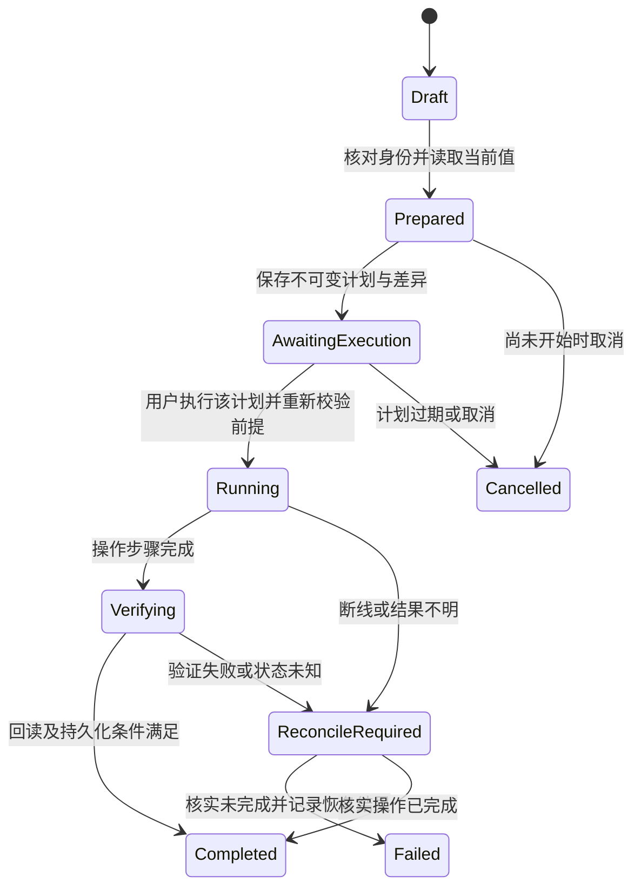

# 实时 OBD 与独立设码架构

日期：2026-09-12；2026-09-13 补充短时接车约束、离线第一版，以及随后的生产读码/清码/数据分析软件。状态：总体架构 + 部分已实现，**实车/硬件未验证**。车型：2014 Boxster S（981）PDK。

本文是设计依据，不是第二份产品需求，也不是 当前进度记录。权威需求：[requirements.md](requirements.md) §R5.1。当前菜单与离线验收：[实时 OBD 说明](obd-live-guide.md)。模拟演练：[离线演练说明](obd-offline-guide.md)。公开资料与设备可行性：[研究方案](research/can-code/981-live-obd-and-coding-roadmap.md)。

硬件仍全部未接；不以设备在线作为架构设计前提。下文未标明「已实现」的路径、实体和设码状态机仍是设计，不要读成已交付。

### 2026-09-13 实现对照

**A–C（离线）已实现**：独立 OBD 进程、模拟适配器、标准响应解析、限时调度、SQLite 原始响应与采样、停止/掉线保留记录、页面展示、重启回放、JSON 导出。入口见 [离线演练说明](obd-offline-guide.md)。

**随后已实现（仍无实车）**：生产连接入口（用户自选端口，PowerShell 串口桥 + 虚拟流离线测）、标准 Mode 03/07/0A 读码、Mode 04 清码（ADR 001 唯一写例外）、Mode 09 VIN/标定、16 个 Mode 01 参数按各 ECU 支持位读取、故障关联数据分析（批限 8、VIN 隔离、单批串行、过期/晚到丢弃）、车辆最新单元档案。操作见 [使用说明](obd-live-guide.md)。

这不代表下文全部设计已交付。仍明确未做：

- vLinker 固件与 Windows 蓝牙/COM **实机**验证；Panda/网络/任意 HEX；厂商扩展诊断与独立设码执行。
- 独立原始 JSONL 文件、抓包导入、高吞吐 CAN 存储。
- 自动最小补采计划、安装包、真实设备只读验证。180 秒是调度预算，不是车辆完成保证。
- 把标准 CAN 解析承诺为真实 vLinker 输出格式兼容。

## 1. 架构决策

1. **vLinker FS BT 是产品主适配器**，Windows 蓝牙 COM/RFCOMM 是待实测的传输路线。MX+ 保留给 RaceChrono，不纳入本项目连接和自动发现选择。
2. **三个本地进程**：Electron 负责界面和协调；独立 Node OBD 进程负责连接、协议与调度；沿用独立 Node DB 进程独占应用的数据库写入。
3. **离线优先开发**：模拟设备、记录回放、原始抓包导入有独立入口，复用正式解析器。界面明确标识模拟/回放/实车来源。
4. **协议与车型定义分开**：标准 OBD 解码不绑定车型；981 扩展功能按 ECU 身份和软件版本加载定义。没有证据的地址、DID、编码位不填默认值。
5. **诊断与设码分开执行**：只读诊断先落地；设码以具体功能定义和独占状态机实现，不开放任意 HEX 发送入口。
6. **SQLite 与知识库在 Windows**；Panda/comma4 是采集外设，X431/PIWIS 是研究对照工具，不成为日常诊断依赖。
7. **现场连接时间是稀缺资源**：先完成离线实现、打包与演练，现场只执行预先生成的有时间预算的采集任务；原始数据自动保存，分析与定义修订在断开车辆后完成。

用户已提出独立设码新方向，本文覆盖该目标的架构。[ADR 001](adr/001-no-ecu-write.md) 现允许专用 Mode 04 清码；编码、刷写、隐藏功能、执行器仍禁止。到具体写车功能落地时，再同步修订 ADR、requirements 和 AGENTS，按已验证功能收敛，不把全部 X431 菜单视为可执行。

## 2. 系统结构



当前 `main.mjs` 已通过 `bridge-lifecycle.mjs` 管理 `db-bridge.mjs`，后者使用系统 Node 的 `node:sqlite`。保持这条链路；新增通信进程不直接打开 `garage.db`，也不把串口访问放到 React。

进程间使用 stdio JSON-lines，不开本地 TCP 服务。OBD worker 的 stdout 只输出协议消息，stderr 输出有界诊断日志。进程启动沿用 `PORSCHE981_NODE` 的解析策略及 Windows 隐藏窗口配置；交付打包时明确 Node 22+ 运行时和串口模块来源，不能依赖用户恰好装有开发环境。

Main 负责跨进程关联和持久化确认；OBD worker 持有唯一设备连接和发送队列；DB worker 对提交结果负责。三个进程都可失败，任何一方重启均不自动恢复未完成写车动作。

## 3. 代码布局与依赖方向

以下路径为 2026-09-12 **设计拆分**，不表示均已按此落盘。当前实际代码更扁：`packages/domain/src/obd.ts`、`obd-production.ts`、`obd-analysis.ts`；`packages/obd/src/engine.mjs`、`production.mjs`、`analysis-reader.mjs`、`simulator.mjs`；Electron `obd-bridge.mjs`、`obd-controller.mjs`、`obd-production-host.mjs`。设计目录仍作后续拆分参考：

```text
packages/domain/src/obd/
  contracts.ts          # 纯数据契约、来源/质量/能力状态
  standard.ts           # 通用 OBD DTC/PID 解码
  isotp.ts              # 原始 CAN 的离线重组与校验
  profiles.ts           # ECU/信号/功能定义校验与匹配
  diagnostics.ts        # 本地诊断规则与证据模型
  operations.ts         # 操作计划/状态转换的纯逻辑

packages/obd/src/
  transport/            # COM；需要时补 RFCOMM、其他硬件后端
  adapters/             # vLinker 的 AT 协议、设备能力探测
  protocol/             # 标准 OBD 客户端、后续扩展诊断客户端
  scheduler/            # 独占队列、取消、超时、采样计划
  session/              # 会话、设备状态、恢复与能力缓存
  acquisition/          # 离线生成采集计划、预算执行、覆盖报告与补采清单
  recording/            # 本地记录、导入、回放、模拟设备
  operations/           # 后续：已验证功能的执行器

apps/desktop/electron/
  obd-bridge.mjs        # OBD worker 入口
  obd-controller.mjs    # Main 侧进程管理、RPC/事件与持久化协调
  main.mjs              # 注册窄 IPC，管理进程生命周期
  preload.cjs           # 业务 API 与订阅/取消订阅
  db-bridge.mjs         # 扩展会话、样本、证据和操作记录方法

apps/desktop/src/
  api.ts                # 增补类型化 OBD API
  pages/ObdPage.tsx      # 六项：设备匹配 / 故障码 / 数据分析 / 车辆信息 / 设码 / 开发与验证
  pages/CodingPage.tsx   # 981 功能库 + X431 参考；不执行编码写入
  obd/                  # 状态订阅、图表、回放、数据分析组件

packages/db/src/        # 迁移、查询、批量写入；唯一 DB 语义入口
data/seed/obd/          # 审核后可提交的信号/ECU/功能定义
data/seed/obd/fixtures/ # 脱敏真实记录；模拟场景单独标识
```

依赖方向：`packages/obd → domain`、`packages/db → domain`；domain 不依赖 Electron、串口、SQLite 或硬件 SDK。desktop 的 API 类型引用 domain 导出的契约。协议解析可纯函数测试，传输实现可替换。

研究稿中统称 `packages/obd` 的解析部分在此进一步拆出纯逻辑，避免引入串口依赖后污染现有业务包。首期不拆出更多 workspace 包。

## 4. 传输、适配器与协议边界

### 4.1 传输层

职责限于打开指定端点、读写字节、关闭和报告链路错误。端点必须由用户选择或由已保存的 vLinker 身份精确匹配；不遍历所有 COM 口发送 AT，不接管 MX+。端口号不是持久设备身份，重连需重新核对。

首个驱动实现以 Windows 出站 COM 为目标。蓝牙服务若没有暴露可用 COM，再实现有证据的 RFCOMM 桥接；不假设该设备是 BLE，也不在界面硬编码 GATT UUID。

### 4.2 vLinker 适配层

负责 AT 初始化、提示符边界、回显、换行、报错分类、报头和过滤配置，保存实际固件/设备身份及能力探测结果。先验证设备侧交互，再明确进入车辆诊断；“端口打开”不等于“车辆已连接”。

同一 AT 通道只允许一个在途命令。输入可能任意分块，不能用串口一次 data 事件作为完整响应；必须等待完整消息边界。未知固件不套用 OBDLink 私有 ST 指令。

### 4.3 诊断协议层

标准 OBD 客户端消费规范化的诊断响应，检查响应来源、服务、参数回显和长度。保存多个 ECU 的独立响应，不能将不同 ECU 的字节拼成一条。

明确两种载荷层次：`can-frame` 与 `diagnostic-pdu`。若适配器已重组 ISO-TP，客户端不得再次当作 CAN 分帧解析；若记录为原始 CAN，由重组器处理帧序号、总长度、流控与超时。Panda 离线重组按捕获的总线/地址/会话关联，无法关联的帧保留为未知，不猜 ECU。

扩展协议客户端后续支持经验证的 UDS 或其他实际协议。会话时序、负响应及 ECU 身份匹配独立于 AT 实现；不能把所有 981 模块统一配置为同一地址或协议。

### 4.4 能力对象

能力至少拆成：设备传输能力、ECU 服务/PID 能力、具体车型功能能力。每项状态为 `unknown | observed-supported | observed-unsupported | verified`，附来源、时间、固件/ECU 身份及定义版本。超时、链路故障、条件不满足不直接转换为“不支持”。

功能目录存在、模拟通过、实车验证是三个不同事实。用户界面由能力状态驱动，未知功能说明缺少的证据，不生成“已支持”徽章。

## 5. 状态、调度与故障处理

连接状态：



回放与模拟是独立运行模式，显示自己的播放状态，不伪装为 `VehicleReady`。停止 worker 后释放串口句柄，陈旧会话令牌作废。

- 调度优先满足在途协议事务的时序与完成，其次执行用户扫描，最后执行周期采样；新任务不抢占正在等待的响应。
- 开始扫描可暂停低优先级采样。开始未来的设码操作前必须完成或中止当前读取，再取得整条适配器连接的独占权。
- 读请求只在已确认可重试时有界重试；用户取消后不再调度新请求。在途结果可保存但不推进已取消任务。
- 掉线后可做有界的设备重连，但不自动恢复采样或设码；重核身份、创建新连接 epoch，并由用户显式恢复读取。
- `NO DATA`、负响应、格式错误、有效无码分开记录。数据过期由 UI 时钟计算，原始样本不改成零。

启动参数先作为可调设计默认值：UI 最多每 100 ms 合并刷新，DB 每 250 ms 或 200 个结果批量落盘，数据积压到 1000 条时暂停发起新采样并显示存储受阻。它们不是设备性能承诺，后续以实测调整；在途响应留有单独缓冲，不因暂停采样而截断。

原始记录写入失败、DB 进程不可用或磁盘不足时结束可靠记录状态，标明已确认保存的边界，不继续显示“已保存”。暂停和恢复均产生事件，图表保留缺口。

## 6. IPC 与业务契约

保持现有手工 `obdSessions:*`、`obdDtcs:*` API 兼容。新增 OBD 实时接口采用明确业务方法；以下是设计签名，运行时同样需要验证参数。

```ts
type Source = "vehicle" | "manual" | "capture" | "replay" | "simulation";
type Request = {
  version: 1;
  id: string;
  method: string;
  params: unknown;
};
type EventEnvelope = {
  version: 1;
  workerEpoch: string;
  seq: number;
  sessionId: number | null;
  source: Source;
  kind: string;
  payload: unknown;
};
```

首期方法：

- `obd:listAdapters()` → 已枚举候选与本机接口；不主动访问车辆。
- `obd:connect({ endpointId, expectedAdapter })` → 设备身份与连接 epoch。
- `obd:probeVehicle({ connectionId })` → 实际协议、响应 ECU、支持能力。
- `obd:scan({ sessionId, scope })` → 扫描任务 ID；scope 首期仅标准 OBD。
- `obd:startSampling({ sessionId, signalIds, planId })`、`obd:stopSampling({ taskId })`。
- `obd:disconnect({ connectionId })` → 停止、刷盘结果与关闭状态。
- `obd:prepareAcquisition({ presetId, budgetMs })` → 离线计划、所需工况和预计覆盖；`obd:runAcquisition({ planId, connectionId })` → 有截止时间的只读采集任务。
- `obd:importCapture({ fileToken })`、`obd:openReplay({ recordingId })`、`obd:replayControl(...)`。
- `obd:getState()` 与 `obd:onEvent(listener)`；订阅必须返回清理函数。

Main 验证 IPC 来源、类型、长度及当前状态；文件选择由 Main 生成短期 token，不接受 renderer 任意路径作为 worker 的读写目标。worker 再验证方法/状态，错误返回机器可读 code、可理解描述及上下文，不把异常堆栈当产品文案。

请求响应保留 request ID；异步事件按 worker epoch + seq 去重和排序。UI 断开订阅后再次挂载先读取状态快照，再续接新事件；丢失事件时重新同步，不能仅靠前端记住的“连接中”。

OBD worker 的事件协议需要新增实现，不能直接假定现有 DB RPC 控制器支持事件流。重用进程管理思路，保留两条桥接的独立故障状态。

## 7. SQLite、原始记录与数据生命周期

所有结构变更走 `packages/db` 的版本化迁移。为现有无统一版本号的 schema 明确基线，先兼容当前条件式迁移，再引入递增迁移记录；迁移失败停止升级，不删除旧手工数据。外键由连接显式开启并做历史一致性检查。

### 首期实体

- **obd_sessions（扩展现有）**：现有 integer ID 保持；增加 source、ended_at、状态、adapter identity、protocol、connection epoch、定义版本快照引用、记录完成度。旧行 source 默认 manual，不补造 ECU 身份。
- **obd_session_ecus（新增）**：会话内 ECU 身份、总线/寻址、实际协议及匹配到的 profile。唯一键至少为 session + bus + address + protocol；未知模块仅以通信来源标识。
- **obd_transactions（新增）**：客户端生成的唯一 ID、session、ECU、开始/结束时间、服务、请求/响应、结果分类、负响应、原始记录引用。一次请求的多 ECU 响应可分别关联。
- **obd_samples（新增）**：session、ECU、signal ID、时间、raw/decoded value、unit、质量、事务与解码版本。索引覆盖 session + ECU + signal + time；样本事件 ID 唯一，DB 重试不重复插入。
- **obd_dtcs（扩展现有）**：保留 manual 状态兼容；补 ECU、原始完整码、通用展示码、协议状态、来源服务、观测时间和事务引用。冻结帧另存上下文快照并关联，不能归到当前实时样本。
- **obd_recordings（新增）**：文件相对路径、格式版本、hash、字节数、时间基准、截断/丢帧状态和导入来源。worker 写文件，Main 通过 DB 桥注册清单。

DTC 扫描每次保存快照；本次未再出现不自动关闭故障台账。就绪状态和支持位图作为结构化观测随会话保存。设备电压与 ECU 电压使用不同 signal ID。

### 扩展诊断与设码阶段实体

- **diagnostic_findings**：会话、规则版本、已观测事实、假设、证据引用、缺失条件、检查步骤及关联零件；与 `fault_logs` 通过显式采纳动作关联。
- **diagnostic_knowledge**：车型/ECU 适用性、完整码与描述、来源页码、核验状态；保留旧 `dtc_kb` 作为通用后备，不直接混入全部 982/991 归档。
- **obd_operation_runs / obd_operation_steps**：操作 UUID、不可变计划及 hash、ECU/固件身份、before/after、步骤意图与确认、最终结果和恢复状态。
- **obd_definition_snapshots**：会话使用的定义正文及 hash；只保存 hash 而不保存定义本体不足以重现旧结果。

### 时间、文件与可靠性

会话记录 UTC 起点与单调时钟基准；时间样本保存相对时间。外部抓包保留原始时钟及精度、对齐偏移与不确定性。Panda 若只有批次接收时间，明确 timestampSource，不伪造逐帧硬件时间。

开发记录根为 `.local/obd/`，打包后为应用 userData 下 `obd/`；子目录为 `recordings/`、`imports/`。导入先只读校验，再复制到受管理位置并计算 hash；拒绝越界路径和不受限大文件。原始序列使用有 schema 版本的 JSONL，未知字段和不完整尾行可保留为导入诊断。

高频原始字节保存在分段文件，规范化结果批量存 SQLite；二者不能跨进程假装原子提交。通过 stable ID、文件 offset/hash 和 DB 已提交 seq 对账；崩溃后恢复为 interrupted，标记未确认尾段。原始日志不是 ECU 完整备份。

首期设置容量提示与停止记录策略，已有记录由用户管理，不自动清除操作审计证据。显示值、保存值和已提交状态分开，降低刷新率不得丢失已接收且承诺记录的样本。

## 8. 车型定义与采集导入

每个 ECU profile 包含身份匹配规则、协议/地址、允许的只读服务、测量值定义、单位/字节序/长度、适用条件、来源、证据与验证状态。定义为受 schema 约束的数据，解码用受控表达式或内置函数 ID，不运行从文件导入的任意 JavaScript。

`definitionStatus` 从 candidate 到 offline-tested 到 vehicle-verified 逐步升级；车辆验证绑定适配器/ECU/固件组合。身份不匹配时只显示未知模块及原始结果，不自动套用“最接近”的版本。

X431/PIWIS 报告导入与 Panda 原始帧导入走不同 importer，归一化后才关联：

1. 导入 manifest、原始记录和操作标记，识别格式/时钟/完整性。
2. 重组诊断事务，对照工具名称、数值与时间窗口。
3. 输出候选 DID/功能定义及支撑事务，保存不确定项。
4. 人工审核为可提交定义，加入脱敏回放用例。
5. 目标设备实测通过后提升能力状态。

原始 CAN 重放在本架构中指“送入本地解析器”，默认无硬件后端，绝不等同于向车辆重发录制帧。模拟场景与真实采集分目录、分来源标记。

## 9. 本地诊断分析

数据链为“事务/样本 → 工况窗口 → 规则匹配 → 证据与检查建议”。规则需声明输入指标、所需工况、时间窗口、阈值来源及缺数行为；缺少条件时返回证据不足，不生成确定性判断。

每条 finding 区分事实与假设，例如“读取到失火码”与“建议检查点火/供油”。关联故障时的冻结帧、当前工况和历史记录，但不将它们当作同一次采样。

前端支持跳到证据曲线、维修来源和已有 Locator 零件位置，再由用户记入故障台账。首期用规则和资料检索即可；未来本地模型通过同一证据接口解释，不能控制通信层或设码执行器。

## 10. 独立设码与特殊功能执行架构

此层是后续阶段设计。功能菜单仅作为索引；可执行 FunctionDefinition 还须包含精确 ECU 匹配、硬件要求、前置条件、读取/比较/执行/验证步骤、写入字段约束、会话要求、访问授权依赖、成功判据和恢复程序。

编码、自适应、维护例程和固件刷写分别建类。首个可执行试点只覆盖一项已验证功能；固件刷写不因底层可发送就自动纳入。



拟新增业务方法为 `coding:prepare({ functionId, target, desiredValues })`、`coding:execute({ planId })`、`coding:getRun({ runId })`。execute 不接受任意 payload；重读 ECU 身份与相关当前值，确认与已保存计划一致后执行，避免预览后车辆配置变化。

每个不可逆步骤的协调顺序：worker 请求记录意图 → Main 调用 DB 持久化 → DB 确认 → Main 允许 worker 执行该步骤 → worker 上报结果 → DB 记录。持久化设置需能满足此确认语义，不能把入内存队列当落盘。拿不到确认不开始新写步骤。

此顺序仍无法使 ECU 与 SQLite 构成原子事务：写车可能已经完成但结果未记下。任何此类中断都进入 `ReconcileRequired`，禁止自动重试或自动续跑；新会话先执行该功能定义中的核验读操作。DB 无法记录时，执行器只走已定义的安全收尾，不继续下一写步骤。

同一 plan/run 的重复 execute 返回既有状态，不重复写车。写车后的取消、ECU reset、点火循环或恢复原值均须由功能定义决定，不能统一用断开连接来实现。备份编码不代表 ECU 固件或全部自适应可恢复。

受挑战响应保护的功能要求已验证的授权实现；单次 seed/key 记录不构成算法。没有访问条件或恢复证据的功能可以预览与研究，不能标成可执行。最终验收需 X431 断开后重新建立会话，验证独立执行及持久化效果。

## 11. 现有 UI 怎样接入

当前产品菜单（2026-09-13，已删除「分析洞察」）：

- **OBD设备匹配设置**：端口选择、vLinker 身份、连接；不自动接管 MX+。
- **故障码**：按 ECU 扫描快照；默认折叠；勾选跳转分析；专用清码。
- **数据分析**：单元/项目勾选、实际值与有效性、批限 8；不是自动修车结论。
- **车辆信息**：实读 VIN/ECU 与手工档案分别显示；VIN 隔离；失败不覆盖。
- **设码**：981 社区功能库 + X431 目录/笔记；可执行写车仍为后续设计。
- **开发与验证**：实时数据趋势、就绪监控、模拟/回放、手工查码/台账。设计中的本地 findings「分析洞察」未作为主菜单交付。

切 Tab 不影响 worker 会话。关闭窗口、退出应用、worker 崩溃分别规定生命周期：只读阶段停止新请求、有限等待在途响应和刷盘后关闭；未来操作运行中由主进程维持功能规定的收尾流程，强制退出后的记录必须进入待核验。

## 12. 没有设备时的实施顺序与验收

**A：契约、解析与模拟。** 新增 domain 契约、标准解码、模拟时钟、模拟设备和回放读取；验证分块、回显、多 ECU、截断、超时、不支持与有效无码。离线模式不得实例化真实传输。

**B：存储与进程。** 新增 DB 迁移、批量幂等写入、OBD worker 与 Main 协调；验证旧手工数据保留、掉进程、队列满、磁盘错误、退出与恢复、事件 epoch 隔离。

**C：页面闭环。** 在模拟/回放下打通连接状态、数据曲线、扫码与会话查看；验证显式来源、数据过期、冻结帧、切 Tab 与订阅清理。到这里不需要任何设备。

**D：vLinker 实机验证。** 生产软件链路已存在（见 live guide），仍待接设备确认 Windows 接口与固件，实测标准读码/PID、掉线重连和与专检共同指标的对照。软件完成 ≠ 实车可用。

**E：981 定义与采集。** 实现 X431/PIWIS 报告与 Panda 日志导入，逐 ECU 建可回溯定义，接入本地诊断规则。

**F：单项设码。** 完成具体功能定义与相应 ADR 修订，离线验证状态机后，在合适台架或受控实车上验证独立执行、回读、恢复及中断处理。

现有 `npm test`、`accept:obd-phase1` 用于兼容性回归；后续新增 OBD 专项测试脚本。测试判据覆盖用户可观察的结果与失败恢复，不以模拟的成功响应证明真实硬件或 ECU 支持。

A–C 及后续生产读码/分析软件已落地（离线验收见 live guide）。待设备输入只影响 D 以后的实车验证。执行顺序同时受下一节的短时接车要求约束：离线准备没有通过，不把安装、开发或问题定位搬到现场。

## 13. 短时接车：提前准备、限时采集、离线分析

2026-09-13 用户明确现场环境不允许长时间连接车辆。因此首轮目标是用很短的车辆占用时间得到下一步开发所需的可靠基线，不以一次现场会话完成全量诊断和全部特殊功能研究为目标。

### 13.1 接车前完成什么

在无设备条件下必须完成：

- 可直接启动的 Windows 开发交付包：所需运行时、依赖、记录目录、磁盘空间检测均在本机就绪，现场无下载、安装和编译。
- vLinker 传输实现、消息解析、限时调度、记录落盘、导入和回放的代码；真实串口/蓝牙身份保留为未验证，不用模拟结果代替。
- 一个“基础采集”入口：开始前显示计划、预算与需要的工况；现场不用逐个选择 PID、输入 AT 或打开开发者工具。
- 至少演练正常、无 ECU 响应、首次协议搜索超时、多 ECU、掉线、存储失败、低吞吐和局部完成；演练结果包括事件时间线、实际保存边界和恢复后的可读会话。
- 提前打开并回放完整与不完整的样例采集包，确认不必再次接车就能查原始响应、重解码和生成下一次补采任务。

若之后有条件在室内为 vLinker 提供符合设备说明的供电，可先验证蓝牙配对、Windows 接口和适配器身份。这是可选的额外准备，不要求现在连接车辆；不把缺少室内供电变成架构或开发阻塞。

**离线就绪门槛**：包可启动、全部模拟场景完成、限时逻辑生效、退出后记录可重新打开，且未触发任何硬件连接。设备侧蓝牙/AT 验证和车辆侧协议验证单独列为未验证项。

### 13.2 第一次接车只跑基础计划

设计默认预算为 **180 秒，包含首次连接/探测与收尾**，可在现场前改为更短。最后 20 秒预留停止新请求与保存。此预算是软件停止调度的设计目标，不是承诺蓝牙配对或车辆一定在三分钟内完成；人工配对耗时单独显示并计入现场总用时。

基础计划只要求停车状态下点火开启，**不以发动机启动为必需条件**。未运行工况下采集到的数据标明该工况，不用来推断暖机、负载或 PDK 动态问题。

按优先级推进，每步保存后再进入下一步：

1. **连接与最小有效响应**：设备身份、实际协议、首个有效 ECU 响应、支持位图。无法建立链路则到时退出并保存失败证据，不循环试遍全部驱动、波特率与协议。
2. **故障基线**：标准已存储/待定 DTC、MIL/就绪信息；可获得的冻结帧优先保存。不同服务或 ECU 的失败不清空其他成功结果。
3. **车辆与能力**：VIN 等支持的身份信息、剩余支持位图；永久码、补充冻结帧在预算允许且请求适用时补齐。
4. **短段实时样本**：只请求已确认支持的少量核心指标，记录有效吞吐、实际间隔和数据质量。点火未启动导致转速为零可以是有效结果。
5. **自动结束**：停止新请求、有限等待在途事务、关闭传输、确认记录完成度，显示“已断开/已保存”或明确的部分失败状态。

首轮不清码、不试写、不穷举 DID/模块地址，也不要求 X431、PT3G、Panda 同时接好。不能为了多拿一个指标无限延长现场停留。

### 13.3 AcquisitionPlan 与运行器

计划是可离线生成、带版本和 hash 的数据，包含：总预算、收尾预算、有序任务、依赖、适用能力、单请求超时、有限重试额度、预计产物和停止条件。没有实测时只标预计覆盖，不给出伪精确完成时间。

每项任务记录 `pending | running | completed | failed | skipped`，skipped 必须附原因，例如预算不足、工况不符、依赖未完成或明确不支持。超时记录失败/未知，不能改写成 ECU 不支持该功能。

运行器以单调时钟控制整个任务截止时间；剩余预算不足以容纳一个请求及收尾时不再开始该请求。默认不重试已失败的可选任务，把时间留给其他高价值信息。握手搜索、超时等待和重连都占用同一预算，不能绕过总限时。

取消、预算耗尽和部分失败均走同一只读收尾路径。UI 在倒计时结束时不得直接宣布断开成功，必须等进程/端口关闭确认；若驱动阻塞超时，Main 终止只读 worker 并记录未确认尾段。这个规则仅适用于本节的只读采集，不得复用于未来写车操作。

### 13.4 带走什么，如何避免重复接车

每次自动产出可在本机重新打开的采集包：计划快照、设备/会话 manifest、原始交互、规范化事务/样本、任务覆盖与失败记录、记录完整性清单。原始交互保存已发送请求和已收到字节，不只保存界面显示出的数字。

离线分析输出三项结果：本次已确认事实、缺失的信息、下一次最小补采计划。解析器有错误时先重放原始记录修正；已有数据能回答的问题不再消耗接车时间。部分完成的计划仍是有效产物，不要求为了“全绿”重复全部任务。

本次能力信息可用于缩短下次采集，但须匹配适配器/ECU 身份和定义版本；更换 ECU、固件或状态不明时重新验证必要前提，不能无条件复用缓存。

### 13.5 后续采集也分次完成

- **第二轮**：根据首轮缺口，只补目标 ECU 身份或某组确有用途的测量值；需要发动机运行或其他工况的任务独立安排，不默认加入首轮。
- **X431/Panda 轮次**：在室内提前验证导出、时钟、日志和静默配置，现场只录预先选定的一项功能。采集与协议分析分开；设备不可用则不临时扩展现场调试。
- **独立设码轮次**：先完成目标功能定义、回放、恢复设计和执行前检查。短时间目标不能压缩功能规定的等待或收尾，也不把它混入基础诊断计划。

这样第一次有限的接车窗口用于确认真实链路与带走原始证据，之后大部分完善工作继续在离线环境完成。
