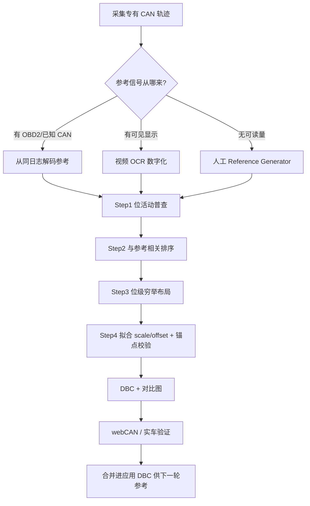

# CAN 总线逆向工程研究方法总结（AI / LLM）

> 来源：[AI CAN Bus Reverse Engineering – CSS Electronics](https://www.csselectronics.com/pages/can-bus-reverse-engineering-ai-llm-claude)  
> 作者：Martin Falch（CSS Electronics）  
> 整理日期：2026-07-12

---

## 1. 问题本质：手工解码为什么难

专有 CAN 信号逆向通常要在海量帧里找「针」：

| 难点 | 说明 |
|------|------|
| 定位 CAN ID | 总线每秒数千帧、数十个 ID，先猜哪个 ID 含目标信号 |
| 定字段布局 | 起始 bit、位宽、字节序（小端/大端）、有无符号 |
| 定物理标定 | scale / offset，把原始值映射到物理量 |
| 反复试错 | 每个信号都有独特 quirks，无通用一键脚本 |

传统人工分析（见 CSS 的 CAN sniffer 文章）往往每个信号要数小时，且需要较强经验。

---

## 2. 核心思路：有参考信号，才能做相关分析

**任何 CAN sniffing 分析都需要一条「参考信号」（reference）**，用来与原始专有 CAN 数据对齐比较。没有可数字化的参考，逆向会非常困难。

### 2.1 三种参考来源（按推荐优先级）

```
优先：CAN 侧已可解码的参考（如 OBD2 车速/转速、GPS→CAN）
  ↓ 没有则
次选：可见物理量 → 录像 + OCR（仪表盘、诊断仪、App 等）
  ↓ 再没有则
兜底：人工实时输入（滑条/按键，同步时间戳）
```

| 类型 | 做法 | 精度 | 适用场景 |
|------|------|------|----------|
| **CAN 参考** | 与专有 CAN 同录（如 OBD2），从日志直接抽出参考 | 最高（机器精确） | 有可解码代理信号时**务必优先** |
| **视觉 OCR** | 录 CAN CSV 同时拍仪表等显示值，OCR 数字化 | 中（噪声可接受） | 有可见数字、无 CAN 参考 |
| **人工输入** | 浏览器小工具按真实动作打点/扫掠 | 较低但可用 | 踏板、方向盘、门锁等无可读数字量 |

### 2.2 为何还要逆向「已有 OBD2」的信号？

专有 CAN 往往更优：

- **分辨率更高**（如 0.1 km/h vs OBD2 的 1 km/h）
- **频率更高**（如 10 Hz vs OBD2 约 0.2 Hz）
- **可静默录制**（无需主动请求 OBD2，降低安装复杂度、注入风险、耗电等问题）

多 PID 轮询时，OBD2 间隔约 0.5 s/个，10 个 PID 周期可达约 5 s，车速更新过慢，专有 CAN 更实用。

### 2.3 参考数据要多长？

| 参考类型 | 建议时长 | 关键点 |
|----------|----------|--------|
| OBD2 等 CAN 参考 | 短途即可（如 ~5 min） | 变化要丰富：静止、加减速、多个稳态速度档 |
| 人工滑条/注入 | 简单信号 1–2 min；嘈杂总线建议 5–10 min | 全量程 + 多样变化 |

**已解码信号应回灌为后续参考**：把逐步积累的应用 DBC 交给 LLM，可排除已知字段，并利用强相关量（如已有车速）辅助解码新信号。

---

## 3. 工具链概念：AI CAN Sniffer

文章方案不是「把 CSV 丢进 ChatGPT」，而是：

**硬件接口（如 CANsub）+ python-can + 本地 LLM Agent（Claude Code Skill）**

### 3.1 Skill 是什么

一个文件夹，包含：

1. **指令**（`SKILL.md` 等）：逐步工作流  
2. **知识材料**：CANsub / python-can 用法、标准 OBD2 DBC、CAN sniffer 基础文  
3. **小型 Python 脚本工具**：供 Agent 按需调用  

Agent 根据提示与数据动态选工具，从原始日志走到可用 DBC。

### 3.2 为何不能只上传 CSV 到网页版 ChatGPT？

1. **上下文**：大段无关原始数据会「冲淡」推理；应喂汇总统计与脚本中间结果  
2. **工具记忆**：网页对话常需每次重写脚本，慢且不一致；Skill 可固化可迭代的工具/流程  
3. **本地控制**：需直接控硬件、读写文件、实时流，本地工作区远比反复上传下载高效  

### 3.3 硬件侧为何适合 CANsub（概念可迁移到任意 python-can）

- LCD 一眼看清录制/总线负载/静默/错误状态  
- webCAN：实时看图、导出 CSV 给 LLM  
- 静默监听 + 错误帧日志，分析时不干扰总线  
- 双 CAN：CAN1 记 OBD2、CAN2 经非接触读专有 CAN，合并一份 CSV  

---

## 4. 标准分析流水线（四步 + 输出）

有了 **轨迹（trace）+ 参考（reference）** 后，核心算法流程如下。

### Step 1：总线活动普查（Bit-activity heatmap）

对每个 CAN ID 统计：帧数、周期规律、载荷长度；对每位算 **翻转率**（帧间 0↔1 频率）。

用途：

- 区分「常变（候选活信号）」与「静态」  
- 标出 **滚动计数器**（时钟式规律翻转）、**校验和字节**（每帧看似随机跳变）并排除  
- 用「低位翻转快、高位翻转慢」启发式猜测多字段边界（可跨字节）

→ 从几十个 ID 缩到短名单，再碰参考信号。

### Step 2：与参考相关（Correlation）

对候选块（CAN ID × 起始字节 × 1/2 字节宽 × 字节序）抽出时间序列，与参考对齐到统一采样网格（sample-and-hold）。

评分要点：

- **窗口化 Spearman 秩相关**（对未知 scale/offset、轻度非线性更稳）  
- 多窗口取中位数，抗毛刺与人工输入噪声  
- 参考在小范围 **时滞** 上滑动取最优（吸收反应延迟）  
- 同时试有符号/无符号；用「像不像真信号」（是否乱跳/环绕）打破平局  
- 跳过计数器；掩码「信号无效」极值（OBD/协议里常见）

→ 锁定大致 CAN ID 与字节起点。

### Step 3：位级穷举（Bitsearch）

在已锁定报文内穷举：起始 bit、位长、Intel/Motorola、signed/unsigned。

- 只测 **实际会变的位**（复用 Step 1）  
- 用与参考的 **线性拟合 R²** 打分（真实字段应对参考呈直线关系）  
- **同等拟合优先更短字段**（更长字段常误吞邻域信号，如左右轮速被并成一个数）

→ 得到精确 bit 布局。

### Step 4：拟合 scale / offset

1. **Scale**：参考 vs 原始值的斜率（多点对斜率取中位数更稳）  
2. **Offset**：固定斜率后，参考与 `scale × raw` 的典型偏差  

健全性检查：

- 把 scale 圆整到 OEM 常见值（如 0.1），仅当圆整几乎不伤拟合  
- **物理锚点**：如停车时车速应为 0，防止「拟合很好但静止仍 −1.6 km/h」  

→ 写入 DBC，并出 **参考 vs 解码** 对比图供人工确认。

### 输出

- 单信号 DBC（`application/signal` 等子目录）  
- 结果图；多信号可合并为应用级 DBC，导入 webCAN 在线校验  

---

## 5. 三种入口工作流（案例方法）

### 工作流 A：CAN 参考（OBD2 车速/转速）—「晴天场景」

1. 用接口同时请求/记录 OBD2 与专有 CAN，导出 CSV  
2. 提示示例：`从 xxx-obd2-can.csv 逆向专有 CAN 中的 Speed 和 RPM`  
3. Agent 解码 OBD2 作参考 → 跑上述四步 → 出 DBC  

**经验**：干净 CAN 参考时，约 **5 分钟内** 可完美还原；可批量「解码所有有 OBD2 PID 参考的信号」。

注意：并非每个 OBD2 PID 都有专有对应；变化极慢（累计里程）或行程内几乎不变（气压）的量难匹配。广撒网轮询 OBD2 不如「有目标、高变化」的短途数据。

### 工作流 B：视觉 OCR 参考

1. 固定摄像头拍仪表（推荐 USB 摄像头与 CAN 采集同一电脑，保证时间戳一致）  
2. 驾驶中覆盖全量程变化（如 0–80 km/h，约 10 min）  
3. 提示示例：`目录里有原始 CAN + 仪表视频，帮我逆向车速`  
4. Agent：抽帧定 ROI → OCR → 人工确认参考质量 → 同四步分析  

**技巧**：固定机位、画面干净、夜间更易 OCR；参考「够用」即可，不必完美。  

**局限**：仪表车速常依法 **≥ 真实车速**（如 UN R39，文章例约高 7%），用仪表作参考时解码会跟仪表偏置，而非绝对真值。

### 工作流 C：人工参考（仪表盘/踏板/门锁等）

1. 实时流式采集（python-can 自动识别设备与波特率）  
2. 打开 **Reference Generator**：  
   - **Sweep**：滑条与真实动作同步扫掠  
   - **Anchor**：在 0% / 25% / 50% / 75% / 100% 各停约 2 s  
3. 尽管人工参考嘈杂，相关 + 位搜索仍可单次命中；同类多通道可外推合并 DBC  
4. 用 webCAN 加载 DBC 边动边看，实时验收  

---

## 6. 方法学要点清单（可复用 checklist）

```
□ 明确目标物理量与是否已有参考
□ 选参考路径：CAN > OCR > 人工
□ 采集：尽量双通道同文件；时间戳对齐；覆盖全量程与动态
□ 普查总线：排除计数器/校验/静态位
□ 相关排序：窗口 Spearman + 时滞 + 符号试探 + 无效值掩码
□ 位搜索：穷举布局；同等拟合取更短字段
□ 标定：中位数斜率 + 偏移；圆整 + 零点等物理锚
□ 产出 DBC + 对比图；webCAN/实车再验
□ 把新 DBC 纳入下一轮，作排除集与新参考
```

---

## 7. 关键结论（文章 takeaways）

| 结论 | 内容 |
|------|------|
| 成功率 | 干净 CAN/视觉参考时，预期可逆向 **90%+** 专有信号，且几乎不要求专家级经验 |
| 嘈杂参考 | 人工输入也能单次成功，但可能需更多迭代 |
| 耗时 | 约 **5–10 分钟/信号**（含人工步骤），相对传统方法约 **95%+** 时间节省 |
| 前提 | **必须有（或能造出）数字化参考**；否则很难 |
| LLM 加成 | 常提出信号特化技巧（如用重力锚定加速度计参考） |

---

## 8. 相关资源

| 资源 | 用途 |
|------|------|
| [原文](https://www.csselectronics.com/pages/can-bus-reverse-engineering-ai-llm-claude) | AI + CANsub + Claude Skill 完整流程与案例 |
| CSS CAN sniffer 文章 | 经典人工逆向基础 |
| GitHub：`can-bus-reverse-engineering-skills` | Skill README、样例数据（约 10 分钟上手） |
| webCAN | 流式可视化、CSV 导出、DBC 实车验证 |
| OBD2 标准 DBC | 从日志解出 CAN 参考 |

---

## 附录：研究流程示意



---

*本文为网页方法论摘要，便于本地查阅与实操对照；硬件与 Skill 细节以 CSS Electronics 原文及 GitHub README 为准。*
